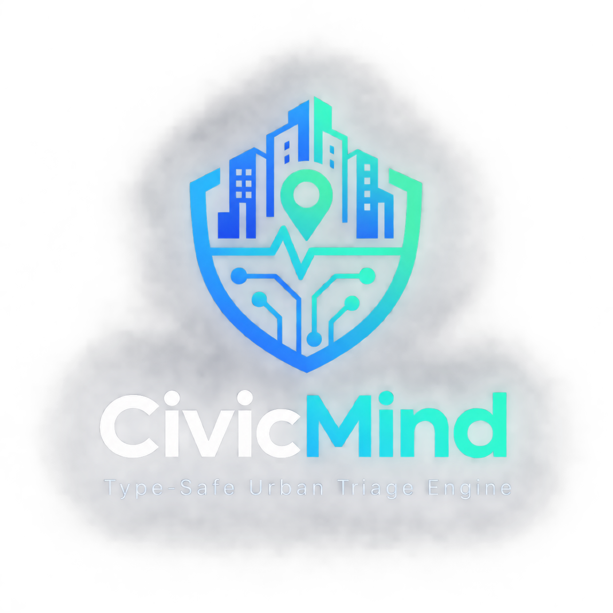

# Motor de triaje asistido por LLM (API type-safe, multi-proveedor)

<p align="center">
  
</p>

> **Type-Safe Urban Triage Engine**  
> From citizen report to actionable decision.
Proyecto I — Módulo V: AI Engineering.

Microservicio backend (FastAPI + Pydantic) que clasifica incidencias
ciudadanas mediante un LLM usando el framework **ReAct** + **Chain-of-Thought**,
más un dashboard **Streamlit** para validación humana (Human-in-the-loop)
y comparación entre un proveedor **local** (Ollama) y uno **externo**
(comercial: Gemini/GPT/Claude, o gratuito: Groq/Hugging Face).

## Por qué esta arquitectura (decisión de diseño)

Se prioriza **Ollama** como proveedor por defecto para:
- Prototipar sin depender de infraestructura de pago.
- Mantener la privacidad de los datos ciudadanos (el texto de la
  incidencia no sale del entorno local).
- Comparar, cuando se necesite, contra un proveedor comercial en
  coste/latencia/calidad — sin acoplar el resto del sistema a un único
  proveedor (de ahí la interfaz `LLMProvider` en `backend/llm/base.py`).

## Estructura

```
triaje-llm/
├── backend/
│   ├── main.py              # Endpoint FastAPI (/triaje, /incidencias, /health)
│   ├── schemas.py           # Modelos Pydantic (entrada, salida, métricas)
│   ├── config.py            # Variables de entorno
│   └── llm/
│       ├── base.py          # Lógica común: validación, reintentos, métricas
│       ├── prompts.py        # System prompt ReAct+CoT, few-shot, anti-sesgo
│       ├── ollama_provider.py    # Proveedor local
│       └── external_provider.py  # Proveedor externo + retry/backoff
├── dashboard/
│   └── app.py                # Streamlit — HITL + comparación de proveedores
├── tests/
│   ├── test_api.py           # Tests de endpoint con mocking del LLM
│   └── test_schemas.py       # Tests de validación Pydantic
├── data/
│   └── sample_incidencias.json
├── requirements.txt
├── .env.example
└── .gitignore
```

## Instalación

```bash
python -m venv venv && source venv/bin/activate  # Windows: venv\Scripts\activate
pip install -r requirements.txt
cp .env.example .env   # rellenar API key del proveedor externo elegido
```

Instalar y arrancar Ollama por separado ([ollama.com](https://ollama.com)):

```bash
ollama pull llama3.1
ollama serve
```

## Ejecución

Backend:
```bash
uvicorn backend.main:app --reload --port 8000
```

Dashboard (en otra terminal, con el backend ya corriendo):
```bash
streamlit run dashboard/app.py
```

## Tests

```bash
pytest -v
```

## Estado del esqueleto / TODOs pendientes

Este scaffold cubre la arquitectura completa y pasa los tests con el
LLM **mockeado**. Antes de la entrega falta:

- [ ] Implementar `ExternalProvider._llamar_api_real` con el SDK del
      proveedor comercial elegido (Gemini/GPT/Claude/Groq) y capturar
      sus errores 429 como `RateLimitError`.
- [ ] Ajustar `Categoria` y los departamentos en `schemas.py` a los
      reales de la plataforma/ayuntamiento.
- [ ] Decidir persistencia (`INCIDENCIAS_PROCESADAS` es en memoria —
      sustituir por SQLite/Postgres si se quiere histórico real).
- [ ] Ajustar precios en `PRECIOS_POR_1K_TOKENS` a las tarifas vigentes.
- [ ] Añadir botones de validar/rechazar por incidencia en el dashboard
      (HITL real, no solo lectura).
- [ ] Revisar y documentar en la presentación oral los sesgos
      detectados y cómo el prompt los mitiga (criterio C10).

## Glosario rápido

Ver el enunciado del reto (`Proyecto_I_Módulo_V__AI_Engineering.pdf`)
para el glosario completo (ReAct, CoT, type-safe, HITL, etc.).
